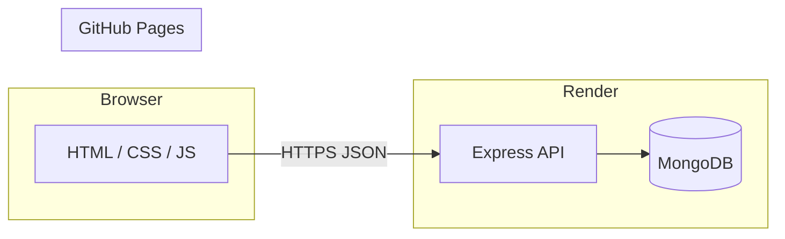

<div align="center">

# SW Technologies

### Full-stack web presence — static UI + REST API

A production-style assignment: a **multi-page marketing site** (HTML, CSS, vanilla JavaScript) backed by **Node.js, Express, MongoDB, and JWT auth**. The same UI works **locally**, on **GitHub Pages**, and against a **hosted API** on Render.

<p>
  
  
  
  
  
  
</p>

**Live site (GitHub Pages)**  
[https://nikky-kumar7505.github.io/SW-Technologies/](https://nikky-kumar7505.github.io/SW-Technologies/)

**Live API (Render)**  
[https://sw-technologies-backend.onrender.com](https://sw-technologies-backend.onrender.com) · [`/api/health`](https://sw-technologies-backend.onrender.com/api/health)

The Pages build loads the UI from `Frontend/` and calls the API base set in [`Frontend/assets/js/config.js`](Frontend/assets/js/config.js) (currently the Render URL above). Change `API_BASE` there if you deploy your own backend.

<p>
  <a href="https://nikky-kumar7505.github.io/SW-Technologies/" target="_blank" rel="noreferrer">
    
  </a>
  <a href="https://sw-technologies-backend.onrender.com/api/health" target="_blank" rel="noreferrer">
    
  </a>
</p>

### To access admin panel

1. Click **Login** in the navbar.  
2. Use these credentials (must match `ADMIN_EMAIL` / `ADMIN_PASSWORD` in `Backend/.env` if you re-seeded with custom values):

| Field | Value |
|--------|--------|
| **Email** | `admin@swtech.com` |
| **Password** | `Admin@12345` |

</div>

---

## Highlights

| Area | What you get |
|------|----------------|
| **Frontend** | Responsive pages (home, about, services, contact), quote modal, newsletter signup, login / register / profile, admin dashboard UI |
| **Backend** | REST JSON API: contact, newsletter, quotes, auth (bcrypt + JWT), admin-only listings |
| **Ops** | CORS-enabled API for cross-origin static hosting; optional serving of `Frontend/` from Express when the folder is present next to `Backend/` |

---

## Feature overview

- **Contact** — validated submissions persisted in MongoDB  
- **Newsletter** — subscribe endpoint with feedback in the UI  
- **Quote requests** — modal form tied to the quote API  
- **Accounts** — register, login, JWT session, profile view  
- **Admin** — JWT-protected routes; seed script creates the admin user from env  
- **Health check** — `GET /api/health` for uptime monitors  

For route-level detail and example responses, see [`Backend/README.md`](Backend/README.md).

---

## Repository layout

```text
assignment/
├── Frontend/          # Static site + client JS (GitHub Pages root)
│   ├── assets/
│   └── *.html
├── Backend/           # Express app, Mongoose models, seed script
│   └── src/
└── README.md          # You are here
```

| Folder | Role |
|--------|------|
| **`Frontend/`** | Round 1-style static site plus Round 2 API wiring (fetch, toasts, auth nav) |
| **`Backend/`** | Express server, MongoDB models, validators, JWT middleware, admin routes |

---

## Architecture (at a glance)



---

## Prerequisites

- **Node.js** 18+ recommended  
- **MongoDB** — Atlas URI or local instance (`MONGODB_URI`)  
- A **JWT secret** for signing tokens in non-demo environments  

---

## Quick start (local full stack)

### 1. Backend environment

Create **`Backend/.env`** (never commit real secrets) with at least:

| Variable | Purpose |
|----------|---------|
| `MONGODB_URI` | MongoDB connection string |
| `JWT_SECRET` | Secret for signing JWTs |
| `ADMIN_EMAIL` | Email for the seeded admin user |
| `ADMIN_PASSWORD` | Plain password for seeding (hashed in DB) |
| `PORT` | Optional; defaults to **5001** |

### 2. Install, seed, run API

```bash
cd Backend
npm install
npm run seed
npm run dev
```

Default URL: **http://localhost:5001** (or your `PORT`).  
If `../Frontend` exists relative to `Backend/`, the server can also serve the static UI from the same origin so `API_BASE` in `config.js` can stay empty for same-host `/api/...` calls.

### 3. Frontend only (optional)

To preview static files without the API server, serve `Frontend/` with any static server (e.g. Live Server, `python3 -m http.server`). Point `Frontend/assets/js/config.js` → `API_BASE` at your running backend URL.

---

## Documentation

| Doc | Contents |
|-----|----------|
| [`Frontend/README.md`](Frontend/README.md) | Pages, local run, deploy notes |
| [`Backend/README.md`](Backend/README.md) | Env vars, endpoints, local quick start |

---

## Scripts (Backend)

| Command | Description |
|---------|-------------|
| `npm run dev` | Run server with `--watch` (auto-restart on file changes) |
| `npm start` | Run server once (typical for production) |
| `npm run seed` | Create/update admin user from `ADMIN_*` env vars |

---

## License

Educational / assignment use. Add a SPDX license file if you publish for reuse.
